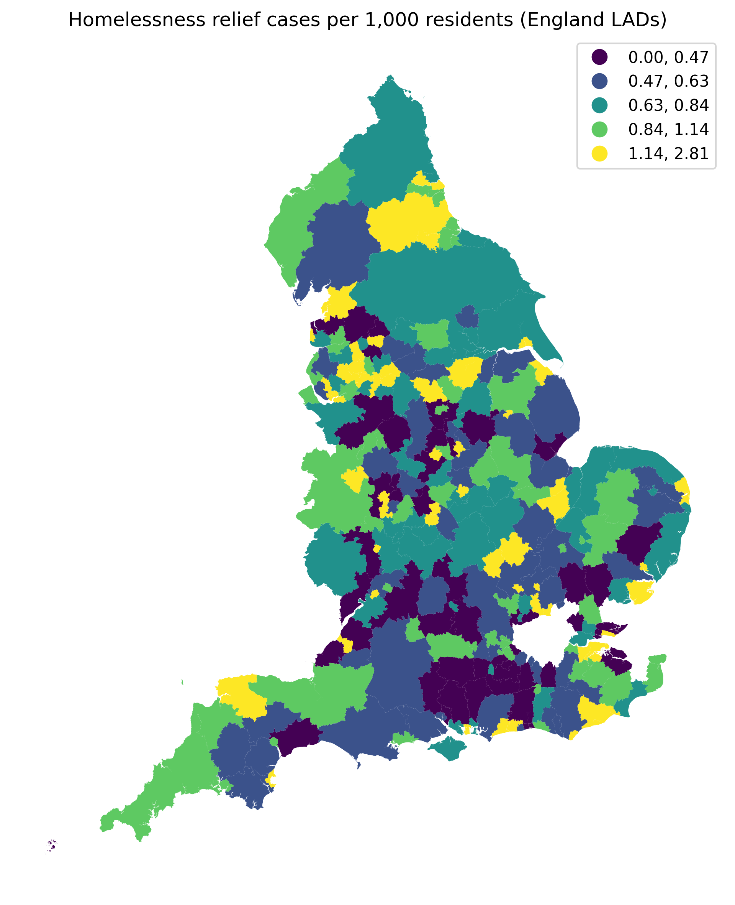
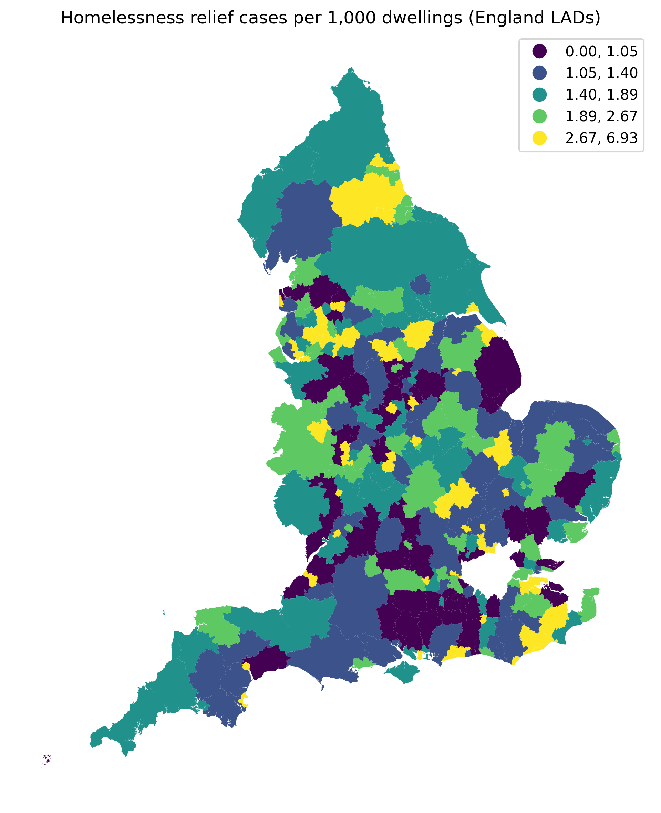

# UK Housing & Homelessness Analysis (England)

## 📌 Project Overview
This project analyses homelessness pressure across English local authorities by combining official homelessness relief data with population and housing stock statistics. Rather than relying on raw counts, the analysis constructs normalised indicators to enable fair comparison between councils of different sizes and housing capacities.

The project demonstrates how **denominator choice (population vs housing stock)** changes the interpretation of homelessness risk and reveals different policy-relevant insights.

---

## 📊 Data Sources
All data used in this project is publicly available UK government data:

- **Homelessness Relief Duty Data**  
  Number of households receiving homelessness relief support (local authority level)

- **Population Estimates (2024)**  
  Resident population per local authority

- **Dwelling Stock Data (2024)**  
  Total number of residential dwellings per local authority

- **ONS Local Authority District Boundaries (GeoJSON)**  
  Used for spatial analysis and mapping

All datasets were cleaned, filtered to England local authorities only, and merged using standardised local authority codes (`la_code`).

---

## 🧹 Data Preparation
Key data preparation steps included:

- Filtering datasets to England local authorities only  
- Standardising local authority codes (`E06`, `E07`, `E08`)
- Resolving merge issues by using `la_code` as the sole join key
- Cleaning and renaming columns for clarity and consistency
- Saving processed, analysis-ready datasets

---

## 📐 Indicators Constructed
Two key indicators were built using the same homelessness numerator but different denominators:

### 1️⃣ Homelessness relief cases per 1,000 residents
**Purpose:** Measures homelessness pressure relative to population  
**Interpretation:** Highlights social demand and population-driven risk

### 2️⃣ Homelessness relief cases per 1,000 dwellings
**Purpose:** Measures homelessness pressure relative to housing supply  
**Interpretation:** Highlights structural housing constraints and system strain

Using both indicators provides a more nuanced understanding of homelessness risk.

---

## 🔍 Analysis Performed
The analysis includes:

- Ranking local authorities under both indicators
- Distribution analysis (mean vs median, skewness, outliers)
- Choropleth mapping of both indicators using quantile classification
- Comparison of rank changes between population-based and dwelling-based measures

This approach allows identification of councils where homelessness pressure is driven primarily by **population demand** versus **housing supply constraints**.

---

## 🗺️ Key Visualisations

### Homelessness Relief per 1,000 Residents


### Homelessness Relief per 1,000 Dwellings


---

## 💡 Key Findings
- Homelessness pressure is **unevenly distributed** across England, with a small number of councils experiencing disproportionately high rates.
- Both indicators show **right-skewed distributions**, meaning averages are influenced by a small number of high-pressure authorities.
- The **geography of homelessness risk changes** depending on the denominator used:
  - Population-based rates emphasise large urban authorities and people-driven demand.
  - Dwelling-based rates highlight smaller, housing-constrained councils that may not appear extreme when population alone is considered.
- Some councils rank highly under **both indicators**, indicating compounded risk driven by both high demand and limited housing supply.

---

## 🏛️ Policy & Analytical Implications
- Homelessness is not solely an urban population issue; in many areas it reflects **structural housing shortages**.
- Using multiple denominators provides more robust, policy-relevant insights than relying on a single metric.
- Spatial clustering suggests homelessness pressure is influenced by **regional housing systems**, not isolated local authority factors.

---

## 🧠 Skills Demonstrated
- Public-sector data analysis
- Data cleaning and harmonisation
- Indicator design and normalisation
- Spatial analysis and choropleth mapping
- Analytical interpretation and policy framing
- Python (pandas, geopandas, matplotlib)

---

## ▶️ How to Run the Project
1. Clone the repository  
2. Install dependencies:
   ```bash
   pip install -r requirements.txt


👤 Author
Muhammad Shaan
MSc Computer Science (Data Analytics)
Carlisle, UK


